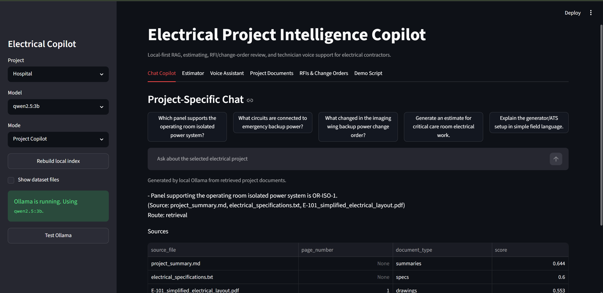
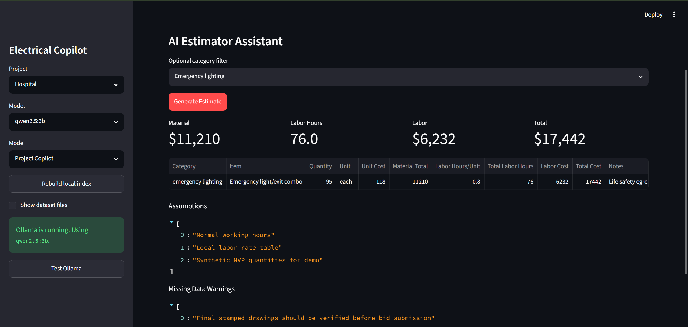

# Interview Demo Script

> I analyzed the company's business model and noticed that electrical contractors deal with a lot of project documents, drawings, RFIs, change orders, safety notes, panel schedules, and estimation workflows. So I built this Electrical Project Intelligence Copilot as a sample prototype to show how AI can reduce document search time, support field technicians, and speed up estimating.

## Problem Statement

Electrical teams lose time searching drawings, panel schedules, RFIs, change orders, and specs. Estimators also need a faster way to turn project quantities into a first-pass cost model.

## Solution Overview

The app lets a user select School, Hospital, or Food Mart and ask questions against only that project's local documents. It also generates estimates, summarizes RFIs and change orders, and provides field-friendly answers.

## Architecture

Streamlit is the single frontend. A supervisor agent routes questions to retrieval, estimator, drawing, RFI/change-order, field technician, or voice handling. Data lives in local folders, with outputs written to `local_db/`.

## Why Streamlit

Streamlit makes the demo fast to run locally, easy to present, and simple to inspect during an interview. It supports chat, tables, file previews, buttons, and download actions without a separate frontend stack.

## Why Local First

Electrical project documents can be sensitive. This MVP avoids paid cloud APIs and keeps documents, vector indexes, chat logs, estimates, and transcripts on the local machine.

## How RAG Works

The ingestion pipeline loads TXT, MD, CSV, JSON, and PDF documents. It chunks text, embeds the chunks, persists vectors locally, and retrieves only chunks matching the selected project. Answers cite source files and refuse missing information.

## How The Estimator Works

Each project has `project_quantities.json`. The estimator joins those quantities to a shared material catalog and labor rate file, then calculates material cost, labor hours, labor cost, total cost, assumptions, and warnings.

## How Voice Mode Works

Voice mode accepts a manual transcript or uploaded audio. The question is routed through field technician mode, which simplifies the answer. Optional local TTS can speak the response using `pyttsx3`.

## Business Impact

- Reduces document search time.
- Helps project managers track open issues.
- Speeds first-pass estimating.
- Gives technicians clearer field instructions.
- Demonstrates AI without sending documents to paid cloud services.

## Future Enhancements

- Real OCR and symbol detection on construction drawings.
- Better RAG reranking and answer scoring.
- Integration with estimating software.
- Role-based access and project audit trails.
- Mobile-first technician interface.

